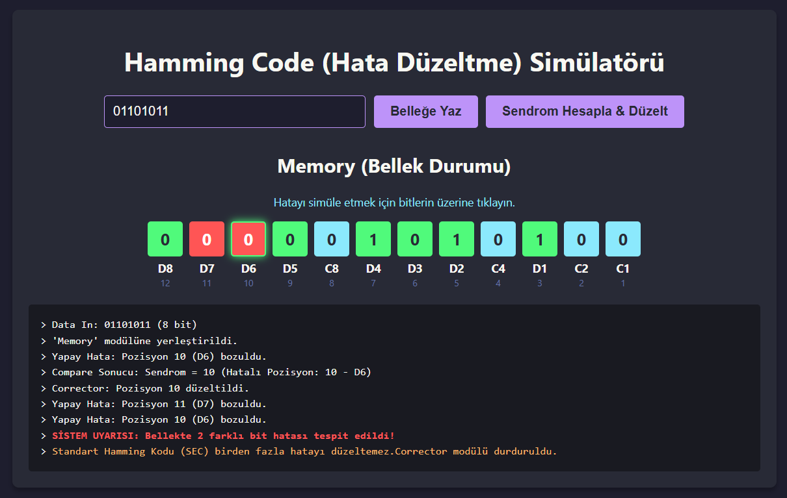
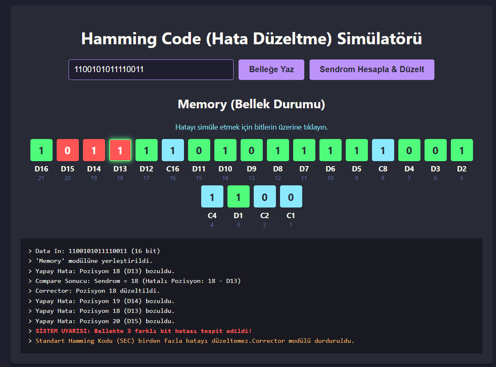
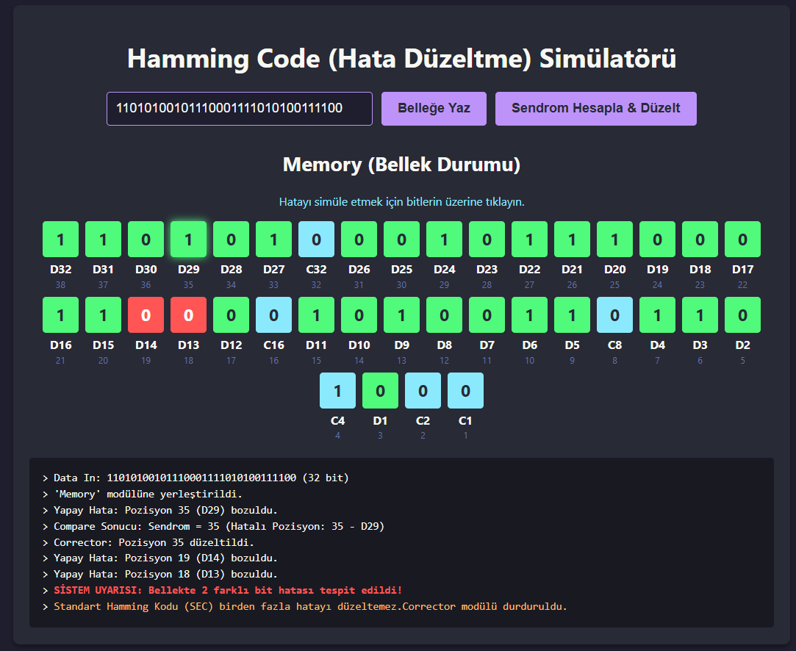

# Hamming Code Simülatörü

Bu proje, bilgisayar mimarisinde bellek hatalarını tespit etmek ve onarmak için kullanılan **Hamming Error-Correcting Code**  algoritmasını görselleştiren web tabanlı bir simülasyondur. JavaScript, HTML ve CSS ile geliştirilmiştir.

## Özellikler

* **Dinamik Ölçeklenebilirlik:** 8, 16 ve 32 bitlik veri girişlerini destekler, gerekli parite (kontrol) bitlerini formüle uygun olarak otomatik hesaplar.
* **Donanım Mimarisi Standartları:** Bellek dizilimi, en az anlamlı bitin (LSB) sağda yer aldığı sağdan sola indeksleme mantığıyla tasarlanmıştır. Veri bitleri (D) ve kontrol bitleri (C) donanım şemalarına uygun şekilde etiketlenmiştir.
* **Yapay Hata Enjeksiyonu:** Bellek arayüzü üzerindeki herhangi bir veri veya kontrol bitine tıklanarak elektriksel/donanımsal bozulmalar (Error Signal) manuel olarak simüle edilebilir.
* **SEC (Single Error Correction):** Tek bitlik hatalar; Compare modülünde XOR mantığıyla hesaplanan "Sendrom Kelimesi" ile tespit edilir ve Corrector modülü tarafından orijinal haline döndürülür.
* **Limit Kontrolü (Aliasing Koruması):** Standart Hamming kodunun matematiksel sınırlarını göstermek amacıyla, bellekte aynı anda birden fazla hata oluştuğunda sistem hatalı onarım yapmak yerine işlemi durdurarak kullanıcıyı uyarır.

## Ekran Görüntüleri

**8-Bit Veri Girişi ve Hata Düzeltme / Çoklu Hata Uyarısı:**

**16-Bit Veri Girişi ve Bellek Dizilimi:**

**32-Bit Veri Girişi ve Dinamik Ölçeklenebilirlik:**

## Teknolojiler

* HTML5
* CSS3 (Flexbox Layout)
* Vanilla JavaScript

## Video Linki

[Youtube Linki](https://youtu.be/nyAsWDhaxsA)

